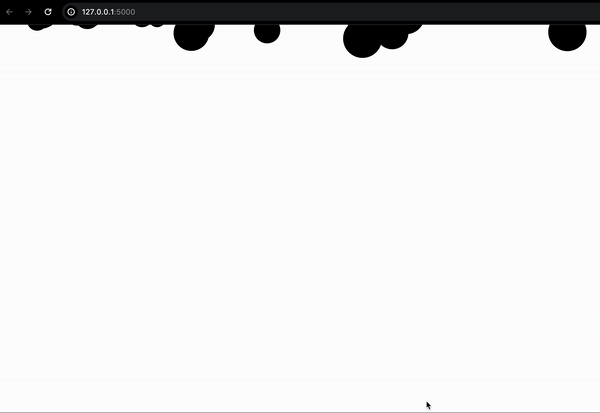

# Bubble Popper

Bubble Popper is a simple web application where users can pop bubbles that fall down the screen.

[](https://bubble-popper-python.onrender.com/)


## Features

- Bubbles fall down automatically at regular intervals.
- Users can click on bubbles to pop them.
- Background image displayed within each bubble.

## Technologies Used

- HTML
- CSS
- JavaScript
- Flask

## Getting Started

To get a local copy up and running follow these simple steps.

### Prerequisites

- Python 3.x
- Flask

### Installation

1. Clone the repo
   ```sh
   git clone https://github.com/your_username_/bubble-popper.git
```
### Contributing
Contributions are what make the open-source community such an amazing place to learn, inspire, and create. Any contributions you make are greatly appreciated.

### Fork the Project
Create your Feature Branch (git checkout -b feature/AmazingFeature)
Commit your Changes (git commit -m 'Add some AmazingFeature')
Push to the Branch (git push origin feature/AmazingFeature)
Open a Pull Request
### License
Distributed under the MIT License. See LICENSE for more information.
